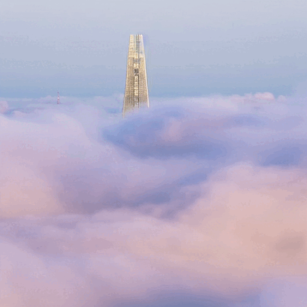
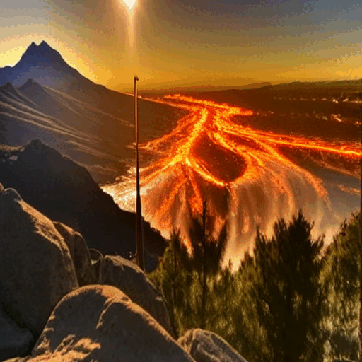
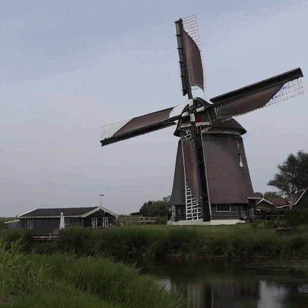
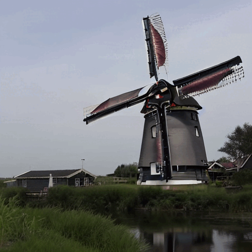
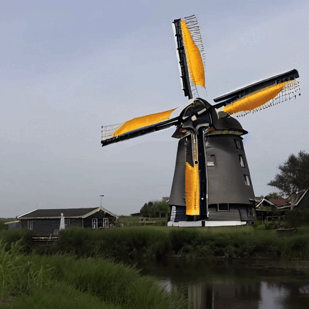

<div align="center">

<h1>Motion-to-Attention: Attention Motion Composer using Optical Flow for Text-to-Video Editing</h1>

[🖼️ Project Page](https://currycurry915.github.io/Motion-to-Attention/) — Visit our project page for more visual results and detailed explanations.
<br>
[📄 Paper (PDF)](results/readme_images/Motion-to-Attention.pdf) — Read the full paper for technical details, methodology, and experimental results.

</div>

---

<br>

<image src="results/readme_images/TCVST_fig1.png"  />
Existing T2V (Text-to-Video) models often struggle to accurately estimate attention maps for motion prompts (e.g., floating, moving), which limits the editability of generated videos. To address this limitation, we propose the Motion-to-Attention (M2A) module. M2A enhances the attention maps across the entire prompt, significantly improving the editing capabilities of existing video editing models.
<br>

</div>

## Abstract
Recent research in text-guided video editing aims to extend image-based editing models to video domains. A significant challenge in this transition is ensuring temporal consistency across frames. However, existing methods often exhibit limited editing accuracy when processing prompts associated with motion, such as "floating" or "moving." Our analysis indicates that this limitation arises from inaccurate attention maps corresponding to motion-related prompts. To address this, we introduce the Motion-to-Attention (M2A) module, explicitly integrating motion information for enhanced video editing precision. Specifically, we first convert optical flow extracted from the video into a comprehensive motion map. Optionally, users can specify directional information to refine motion map extraction further. The proposed M2A module incorporates two complementary techniques: Attention-Motion Swap, which directly substitutes the imprecise attention map of motion prompts with the extracted motion map, and Attention-Motion Fusion, which adaptively enhances attention maps based on the correlation with the motion map using a carefully selected fusion metric. Experimental validation demonstrates that incorporating our M2A module into existing text-to-video editing frameworks significantly improves both quantitative performance metrics (CLIP-Acc, Masked PSNR, BRISQUE) and qualitative visual quality. Extensive experiments and comparative studies confirm the superior editability and robustness of our method over current state-of-the-art approaches.


## Our Frameworks
<image src="results/readme_images/TCSVT_framework.png"  />
The left side of the figure shows the overall framework of video editing by enhancing the attention map. First, the Text-to-Video (T2V) Model generates an attention map by receiving video and prompts as input. Simultaneously, the optical flow estimation model estimates the optical flow from the input video frames. The estimated optical flow is converted to a motion map by default using only magnitude information. Optionally, when direction information is provided by the user, the Direction Control converts the optical flow to a motion map that only shows movement in the user-specified direction. If the user indicates directional words with [], the model captures the direction information and performs Direction Control. Then, the motion map is injected into the attention map of the T2V-Model in two ways from the M2A module: Attention-Motion Fusion and Attention Motion Swap. After that, text-to-video editing is performed using the attention map enhanced by the motion map. The right side of the figure shows how the Attention-Motion Swap and Attention-Motion Fusion of the M2A module enhance the attention map with the motion map.


## Experimental Results
<image src="results/readme_images/tables.PNG"  />


### You can find more experimental results [on our project page](https://currycurry915.github.io/Motion-to-Attention/).

<table class="center">
<tr>
  <td align="center" ><b>Input Video</b></td>
  <td align="center" ><b>Video-P2P</b></td>
  <td align="center" ><b>Ours</b></td>
</tr>

 <tr>
  <td align="center" width=25% style="text-align:center;color:gray;">"Clouds {flowing} under a skyscraper"</td>
  <td align="center" width=25% style="text-align:center;">"Waves {flowing} under a skyscraper"</td>
  <td align="center" width=25% style="text-align:center;color:gray;">"Waves {flowing} under a skyscraper"</td>
</tr>

<tr>
  <td align="center" style colspan="1"></td>
  <td align="center" style colspan="1"></td>
  <td align="center" style colspan="1"></td>
</tr>


<tr>
  <td align="center" width=25% style="text-align:center;color:gray;">"Clouds {flowing} on the mountain"</td>
  <td align="center" width=25% style="text-align:center;">"Lava {flowing} on the mountain"</td>
  <td align="center" width=25% style="text-align:center;color:gray;">"Lava {flowing} on the mountain"</td>
</tr>

<tr>
  <td align="center" style colspan="1"></td>
  <td align="center" style colspan="1"></td>
  <td align="center" style colspan="1"></td>       
</tr>

<tr>
  <td align="center" width=25% style="text-align:center;color:gray;">"{Spinning} wings of windmill are beside the river"</td>
  <td align="center" width=25% style="text-align:center;">"Yellow {spinning} wings of windmill are beside the river"</td>
  <td align="center" width=25% style="text-align:center;color:gray;">"Yellow {spinning} wings of windmill are beside the river"</td>
</tr>

<tr>
  <td align="center" style colspan="1"></td>
  <td align="center" style colspan="1"></td>
  <td align="center" style colspan="1"></td>       
</tr>
</table>


## Setup

The environment is very similar to [Video-P2P](https://github.com/ShaoTengLiu/Video-P2P).

The versions of the packages we installed are:

torch: 1.12.1 \
xformers: 0.0.15.dev0+0bad001.d20230712

In the case of xformers, I installed it through the [link](https://github.com/bryandlee/Tune-A-Video/issues/4) introduced by Video-P2P.

```shell
pip install -r requirements.txt
```


## Weights

We use the pre-trained stable diffusion model. You can download it [here](https://huggingface.co/runwayml/stable-diffusion-v1-5). 


## Quickstart

Since we developed our codes based on Video-P2P codes, you could refer to their [github](https://github.com/ShaoTengLiu/Video-P2P), if you need.

Please replace **pretrained_model_path** with the path to your stable-diffusion.

To download the pre-trained model, please refer to [diffusers](https://github.com/huggingface/diffusers).


``` bash
# Stage 1: Tuning to do model initialization.

# You can minimize the tuning epochs to speed up.
python run_tuning.py  --config="configs/cloud-1-tune.yaml"
```

``` bash
# Stage 2: Attention Control

python run_motion_to_attention.py --config="configs/cloud-1-p2p.yaml" --motion_prompt "Please enter motion prompt"

# If the prompt is "clouds flowing under a skyscraper", the motion prompt is "flowing".
# You can input the motion prompt as below.

python run_motion_to_attention.py --config="configs/cloud-1-p2p.yaml" --motion_prompt "flowing"
```

Find your results in **Video-P2P/outputs/xxx/results**.


## Acknowledgements
This repository borrows heavily from [Video-P2P](https://github.com/ShaoTengLiu/Video-P2P). Thanks to the authors for sharing their code and models.

